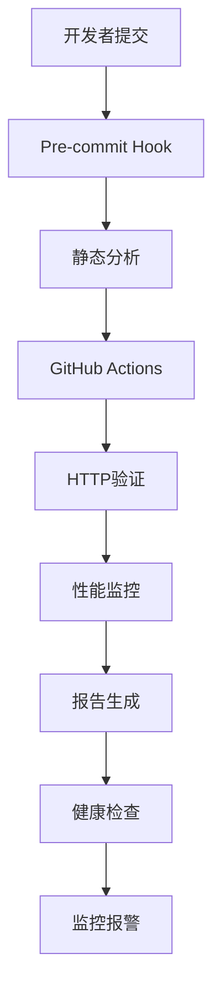

# 🗺️ Sitemap持续验证和测试体系 - 完整指南

这是AI Action Figure生成器项目的Sitemap质量保障体系的完整使用指南。本体系提供了从开发到生产环境的全面质量保障，确保网站URL结构的长期稳定性和可靠性。

## 📋 目录

- [系统概述](#系统概述)
- [快速开始](#快速开始)
- [核心工具详解](#核心工具详解)
- [使用场景](#使用场景)
- [CI/CD集成](#cicd集成)
- [监控和报警](#监控和报警)
- [故障排除](#故障排除)
- [最佳实践](#最佳实践)
- [API参考](#api参考)

## 🎯 系统概述

### 核心组件



### 系统特性

- ✅ **多层验证**: 静态分析 → HTTP验证 → 性能监控
- 🔄 **持续监控**: 自动化CI/CD集成和定时健康检查
- 📊 **智能报告**: 多格式报告生成和趋势分析
- 🚨 **主动报警**: Slack/邮件通知和GitHub Issue创建
- 🛠️ **开发者友好**: Pre-commit钩子和本地验证工具

## 🚀 快速开始

### 1. 安装和配置

```bash
# 1. 确保项目依赖已安装
pnpm install

# 2. 安装Git钩子（可选但推荐）
pnpm run sitemap:install-hooks

# 3. 运行快速健康检查
pnpm run sitemap:health:quick
```

### 2. 基础验证

```bash
# 静态分析 - 检查sitemap配置与页面文件匹配
pnpm run sitemap:analyze

# 快速验证 - 仅静态分析
pnpm run sitemap:quick

# 标准验证 - 静态分析 + HTTP测试
pnpm run sitemap:validate

# 完整验证 - 包含性能监控
pnpm run sitemap:full
```

### 3. 查看结果

验证完成后，报告将保存在：
- 静态分析: `test/sitemap/sitemap_404_diagnosis.json`
- 验证报告: `test/sitemap/reports/latest-{mode}.json`
- 性能报告: `test/sitemap/performance-reports/latest-performance.json`
- 健康检查: `test/sitemap/health-reports/latest-{environment}.json`

## 🔧 核心工具详解

### 1. 静态分析器 (`analyze_sitemap.js`)

**功能**: 不启动服务器的情况下分析sitemap配置

```bash
# 基础用法
node test/sitemap/analyze_sitemap.js

# 使用npm script
pnpm run sitemap:analyze
```

**输出**:
- 总URL数和匹配成功数
- 成功率百分比
- 详细的问题列表和修复建议
- JSON格式的诊断报告

### 2. 持续验证器 (`continuous-validation.js`)

**功能**: 多模式的全面验证工具

```bash
# 快速模式 - 仅静态分析
pnpm run sitemap:quick

# 标准模式 - 静态分析 + HTTP验证
pnpm run sitemap:validate

# 完整模式 - 包含性能监控
pnpm run sitemap:full

# 监控模式 - 持续监控（5分钟间隔，1小时持续）
pnpm run sitemap:monitor
```

**配置选项**:
```javascript
// 在脚本中修改CONFIG对象
const CONFIG = {
  SERVER_PORT: 3000,
  SUCCESS_THRESHOLD: 95,
  REQUEST_TIMEOUT: 10000,
  PARALLEL_REQUESTS: 5
};
```

### 3. 性能监控器 (`performance-monitor.js`)

**功能**: 深度性能分析和基准测试

```bash
# 运行性能监控
pnpm run sitemap:performance

# 直接调用
node test/sitemap/performance-monitor.js --verbose
```

**监控指标**:
- 基础响应时间测试
- 并发负载测试
- 缓存效率检查
- SEO性能指标评估

### 4. 健康检查器 (`sitemap-health-check.js`)

**功能**: 生产环境健康检查

```bash
# 生产环境标准检查
pnpm run sitemap:health

# 快速检查
pnpm run sitemap:health:quick

# 深度检查（包含性能）
pnpm run sitemap:health:deep

# 本地环境检查
pnpm run sitemap:health:local
```

**环境支持**:
- `local`: localhost:3000 (需要运行开发服务器)
- `staging`: 预发布环境
- `production`: 生产环境 (默认)

### 5. Pre-commit钩子 (`pre-commit-sitemap.js`)

**功能**: Git提交前自动验证

```bash
# 安装钩子
pnpm run sitemap:install-hooks

# 手动运行钩子验证
node test/sitemap/hooks/pre-commit-sitemap.js --verbose

# 卸载钩子（如需要）
rm .git/hooks/pre-commit
```

**触发条件**:
- 修改 `src/app/**/page.tsx` 或 `src/app/**/page.mdx`
- 修改 `src/app/sitemap.ts`
- 修改 `src/middleware.ts`
- 修改 `src/i18n/**/*`

### 6. 报告生成器 (`reporter.js`)

**功能**: 生成多格式详细报告

```bash
# 基础报告生成
node test/sitemap/reporter.js test/sitemap/reports/latest-standard.json

# 自定义格式和主题
node test/sitemap/reporter.js result.json --format=html,md --theme=modern

# 生成分发报告
node test/sitemap/reporter.js result.json --share --output-dir=./reports
```

**支持格式**:
- JSON: 结构化数据
- HTML: 可视化报告（包含图表）
- Markdown: 轻量级文档格式

## 🎭 使用场景

### 场景1: 日常开发

```bash
# 开发新页面后
pnpm run sitemap:quick

# 提交前验证（自动触发或手动）
git commit -m "新增产品页面"

# 如果验证失败，查看详细报告
cat test/sitemap/sitemap_404_diagnosis.json
```

### 场景2: 发布前验证

```bash
# 完整验证流程
pnpm run sitemap:full

# 生成发布报告
node test/sitemap/reporter.js test/sitemap/reports/latest-full.json \
  --format=html,md --output-dir=./release-reports

# 检查生产环境
pnpm run sitemap:health:deep
```

### 场景3: 问题排查

```bash
# 1. 分析sitemap配置
pnpm run sitemap:analyze

# 2. 检查HTTP状态
pnpm run sitemap:validate

# 3. 分析性能问题
pnpm run sitemap:performance

# 4. 生产环境健康检查
pnpm run sitemap:health
```

### 场景4: 持续监控

```bash
# 启动监控模式（5分钟间隔）
pnpm run sitemap:monitor

# 或者设置自定义间隔（10分钟间隔，2小时持续）
node test/sitemap/continuous-validation.js monitor --interval=600 --duration=7200
```

## 🔄 CI/CD集成

### GitHub Actions 工作流

工作流文件: `.github/workflows/sitemap-check.yml`

**触发条件**:
- Push到main分支
- Pull Request
- 每日定时检查 (凌晨2点)
- 手动触发

**工作流程**:
```yaml
1. 静态分析 → 2. HTTP验证 → 3. 性能监控 → 4. 报告生成
```

**手动触发示例**:
```bash
# 在GitHub Repository页面:
# Actions → Sitemap持续验证 → Run workflow
# 选择验证模式: quick/standard/full
# 选择是否包含性能测试
```

### 状态检查

- ✅ **通过**: 成功率 ≥ 95%，无关键错误
- ❌ **失败**: 成功率 < 95%，存在关键问题
- ⚠️ **警告**: 存在性能问题或非关键错误

## 🚨 监控和报警

### 报警级别

| 级别 | 触发条件 | 通知方式 |
|------|----------|----------|
| 🔴 CRITICAL | 成功率 < 50% | Slack + 邮件 + GitHub Issue |
| 🟡 WARNING | 成功率 < 80% | Slack + 邮件 |
| 🟢 INFO | 成功率 ≥ 95% | 仅日志记录 |

### 配置报警

**环境变量**:
```bash
# Slack通知
export SLACK_WEBHOOK_URL="https://hooks.slack.com/services/..."

# 邮件通知
export EMAIL_API_ENDPOINT="https://api.sendgrid.com/v3/mail/send"
export ALERT_EMAIL="admin@actionfigure-generator.com"

# GitHub集成
export GITHUB_API_TOKEN="ghp_..."
```

**健康检查配置**:
```javascript
// scripts/sitemap-health-check.js
const HEALTH_CHECK_CONFIG = {
  THRESHOLDS: {
    SUCCESS_RATE: 95,
    RESPONSE_TIME: 3000,
    PERFORMANCE_SCORE: 80
  },
  ALERTS: {
    ENABLED: true,
    CRITICAL_THRESHOLD: 50,
    WARNING_THRESHOLD: 80
  }
};
```

## 🩺 故障排除

### 常见问题

#### 1. 服务器启动失败
```bash
# 错误: 服务器启动超时
# 解决方案:
netstat -an | grep 3000  # 检查端口占用
pkill -f "next dev"      # 终止现有进程
pnpm run dev             # 重新启动
```

#### 2. 验证失败率高
```bash
# 1. 检查sitemap配置
cat src/app/sitemap.ts

# 2. 检查页面文件结构
find src/app -name "page.tsx" -o -name "page.mdx"

# 3. 运行静态分析
pnpm run sitemap:analyze

# 4. 查看详细问题
cat test/sitemap/sitemap_404_diagnosis.json
```

#### 3. 性能监控异常
```bash
# 检查网络连接
curl -I https://actionfigure-generator.com

# 本地性能测试
pnpm run sitemap:health:local

# 减少测试URL数量
# 编辑 test/sitemap/performance-monitor.js
# 修改 testUrls 数组
```

#### 4. 钩子不生效
```bash
# 检查钩子文件
cat .git/hooks/pre-commit

# 重新安装钩子
pnpm run sitemap:install-hooks

# 手动测试钩子
node test/sitemap/hooks/pre-commit-sitemap.js --verbose
```

### 调试模式

```bash
# 启用详细输出
export PRE_COMMIT_VERBOSE=1

# 禁用提交阻止（仅警告）
export PRE_COMMIT_BLOCK=0

# 运行调试验证
node test/sitemap/continuous-validation.js standard --verbose
```

## 💡 最佳实践

### 开发阶段

1. **早期验证**: 新增页面后立即运行快速验证
2. **提交前检查**: 依赖pre-commit钩子自动验证
3. **定期清理**: 删除无用页面时检查sitemap配置

```bash
# 开发最佳实践流程
git add .
# → pre-commit钩子自动运行
pnpm run sitemap:quick  # 可选的手动验证
git commit -m "新增功能页面"
```

### 测试阶段

1. **完整验证**: 使用full模式进行全面测试
2. **性能基准**: 建立性能基准线
3. **回归测试**: 对比历史数据检查回归

```bash
# 测试阶段实践
pnpm run sitemap:full
pnpm run sitemap:performance
node test/sitemap/reporter.js test/sitemap/reports/latest-full.json --format=html
```

### 生产阶段

1. **健康监控**: 定期运行健康检查
2. **性能监控**: 监控响应时间趋势
3. **主动报警**: 配置自动化报警机制

```bash
# 生产监控实践
pnpm run sitemap:health          # 每日检查
pnpm run sitemap:health:deep     # 每周深度检查
pnpm run sitemap:monitor         # 持续监控模式
```

### 团队协作

1. **文档更新**: 新增页面时更新URL文档
2. **规范检查**: 建立URL命名规范
3. **知识分享**: 分享验证报告和性能数据

## 📖 API参考

### 验证模式

| 模式 | 功能 | 时间 | 适用场景 |
|------|------|------|----------|
| `quick` | 静态分析 | ~10秒 | 开发调试 |
| `standard` | 静态+HTTP | ~30秒 | 日常验证 |
| `full` | 完整验证 | ~60秒 | 发布前检查 |
| `monitor` | 持续监控 | 持续 | 生产监控 |

### 健康检查级别

| 级别 | 检查内容 | 时间 | 输出 |
|------|----------|------|------|
| `quick` | 基础可用性 | ~15秒 | 简要报告 |
| `standard` | 可用性+sitemap | ~45秒 | 标准报告 |
| `deep` | 完整+性能 | ~90秒 | 详细报告 |

### 配置参数

#### 持续验证器配置
```javascript
const CONFIG = {
  SERVER_PORT: 3000,              // 服务器端口
  SUCCESS_THRESHOLD: 95,          // 成功率阈值
  REQUEST_TIMEOUT: 10000,         // 请求超时(ms)
  PARALLEL_REQUESTS: 5,           // 并发请求数
  MAX_RETRIES: 3,                 // 重试次数
  RETRY_DELAY: 1000              // 重试延迟(ms)
};
```

#### 性能监控配置
```javascript
const PERFORMANCE_CONFIG = {
  WARMUP_REQUESTS: 3,            // 预热请求数
  TEST_ITERATIONS: 10,           // 测试迭代次数
  CONCURRENT_USERS: [1,5,10,20], // 并发用户数
  THRESHOLDS: {
    EXCELLENT: 500,              // 优秀响应时间
    GOOD: 1000,                  // 良好响应时间
    ACCEPTABLE: 2000             // 可接受响应时间
  }
};
```

#### 健康检查配置
```javascript
const HEALTH_CHECK_CONFIG = {
  THRESHOLDS: {
    SUCCESS_RATE: 95,            // URL成功率阈值
    RESPONSE_TIME: 3000,         // 响应时间阈值
    PERFORMANCE_SCORE: 80        // 性能评分阈值
  },
  ALERTS: {
    CRITICAL_THRESHOLD: 50,      // 关键问题阈值
    WARNING_THRESHOLD: 80        // 警告阈值
  }
};
```

## 🎯 高级用法

### 自定义验证规则

```javascript
// 修改 test/sitemap/analyze_sitemap.js
const customValidation = {
  // 自定义URL模式
  customPatterns: [
    '/api/v1/**',
    '/admin/**'
  ],
  
  // 排除模式
  excludePatterns: [
    '/test/**',
    '/dev/**'
  ],
  
  // 自定义检查逻辑
  customChecks: {
    checkSEOFriendly: (url) => {
      return !url.includes('?') && !url.includes('#');
    }
  }
};
```

### 自定义性能指标

```javascript
// 修改 test/sitemap/performance-monitor.js
const customMetrics = {
  // 自定义阈值
  customThresholds: {
    API_RESPONSE: 1000,
    PAGE_LOAD: 2000,
    INTERACTIVE: 3000
  },
  
  // 自定义测试
  customTests: {
    testAPIEndpoint: async (baseUrl) => {
      // 自定义API测试逻辑
    },
    
    testMobilePerformance: async (url) => {
      // 移动端性能测试
    }
  }
};
```

### 集成其他工具

#### 与Lighthouse集成
```bash
# 安装Lighthouse
npm install -g lighthouse

# 创建自定义脚本
# scripts/lighthouse-integration.js
```

#### 与Sentry集成
```javascript
// 添加错误监控
const Sentry = require('@sentry/node');

Sentry.init({
  dsn: process.env.SENTRY_DSN
});

// 在验证失败时发送错误
Sentry.captureException(new Error('Sitemap validation failed'));
```

## 📊 报告格式参考

### JSON报告结构
```json
{
  "timestamp": "2025-09-01T10:30:00.000Z",
  "mode": "standard",
  "duration": 45000,
  "summary": {
    "totalUrls": 37,
    "successfulUrls": 36,
    "failedUrls": 1,
    "successRate": 97.3,
    "overallScore": 85,
    "overallRating": "GOOD"
  },
  "details": {
    "staticAnalysis": { /* 静态分析详情 */ },
    "httpValidation": [ /* HTTP验证结果 */ ],
    "performanceAnalysis": [ /* 性能分析数据 */ ]
  },
  "insights": {
    "keyFindings": [ /* 关键发现 */ ],
    "recommendations": [ /* 改进建议 */ ]
  }
}
```

### HTML报告特性
- 📊 交互式图表（Chart.js）
- 📱 响应式设计
- 🎨 现代化UI
- 🔗 直接链接到问题URL
- 📈 趋势分析图表

### Markdown报告特性
- ✅ GitHub兼容格式
- 📋 表格化数据展示
- 🔗 自动链接生成
- 📊 文本图表
- 💾 轻量级存储

---

## 🤝 贡献指南

### 添加新功能

1. **创建功能分支**
```bash
git checkout -b feature/new-validation-feature
```

2. **编写测试**
```bash
# 在 test/sitemap/ 目录下添加测试
touch test/sitemap/test-new-feature.js
```

3. **更新文档**
```bash
# 更新本指南和相关README
vim test/sitemap/TESTING_GUIDE.md
```

### 报告问题

请在GitHub Issues中报告问题，包含：
- 错误复现步骤
- 预期和实际结果
- 环境信息（Node.js版本、操作系统等）
- 相关日志和报告

### 性能优化建议

欢迎提交性能优化建议：
- 减少验证时间
- 降低资源消耗
- 提高并发效率
- 优化报告生成

---

*📝 本指南会持续更新，建议定期查看最新版本*

*🔗 相关链接:*
- *[GitHub Repository](https://github.com/your-org/actionfigure-generator)*
- *[问题反馈](https://github.com/your-org/actionfigure-generator/issues)*
- *[功能建议](https://github.com/your-org/actionfigure-generator/discussions)*